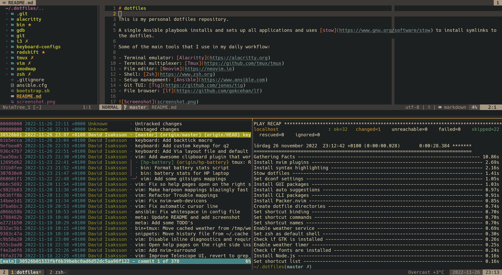

# dotfiles

This is my personal dotfiles repository.

A single Ansible playbook installs and sets up all applications and uses [stow](https://www.gnu.org/software/stow) to install symlinks to the dotfiles.

Some of the main tools that I use in my daily workflow:

- Terminal emulator: [Alacritty](https://alacritty.org)
- Terminal multiplexer: [Tmux](https://github.com/tmux/tmux)
- File editor: [Neovim](https://neovim.io)
- Shell: [Zsh](https://www.zsh.org)
- Setup management: [Ansible](https://www.ansible.com)
- Git TUI: [Tig](https://github.com/jonas/tig)
- File browser: [lf](https://github.com/gokcehan/lf)




## Installation

**NOTE: Please *READ* and *UNDERSTAND* what the script and playbook does before executing**

```bash
$ ./bootstrap.sh
$ ansible-playbook setup.yml -K
```


## Other fun stuff

- Monospace font: [Hack](https://github.com/source-foundry/Hack)
- Color scheme: [Gruvbox](https://github.com/morhetz/gruvbox)

Custom [Vimium](https://chrome.google.com/webstore/detail/vimium/dbepggeogbaibhgnhhndojpepiihcmeb) mappings for Chrome

```vim
unmap <a-p>
map <a-n> nextTab
map <a-p> previousTab
```
